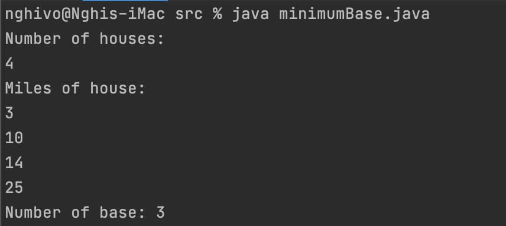

# GreedyAlgorithm
Name: Ivy Vo

## Description
Using Algorithm Design Jon Kleinberg. Exercise 5 in Chapter 4: Greedy Algorithm
- Let’s consider a long, quiet country road with houses scattered very
sparsely along it. (We can picture the road as a long line segment, with
an eastern endpoint and a western endpoint.) Further, let’s suppose that
despite the bucolic setting, the residents of all these houses are avid cell
phone users. You want to place cell phone base stations at certain points
along the road, so that every house is within four miles of one of the base
stations.
Give an efficient algorithm that achieves this goal, using as few base
stations as possible.

## Requirement
- Require IDE that can work with Java
- Clone the repo
```
gh repo clone dongnghi05/GreedyAlgorithm
```
- Open the project in IDE.
- Run on terminal

## User Manual
- On terminal, direct to the project file
```
cd GreedyAlgorithm
cd main
cd src
java minimumBase.java
```
- The program will ask for number of houses. 
- The program will ask for location of house in miles.

## Results
-

